# 🧬 Breast Cancer Segmentation Using Hybrid U-Net and NSCGCN Architecture

<div align="center">

[](https://www.python.org/)
[](https://pytorch.org/)
[](https://albumentations.ai/)
[](LICENSE)
[](Final_Internship_Report.pdf)

<p align="center">
  <strong>An Advanced Deep Learning Pipeline Combining U-Net with Non-Local Spatial Context Graph Convolutional Networks (NSCGCN) for High-Precision Breast Ultrasound Lesion Segmentation</strong>
</p>

<p align="center">
  <b>Author:</b> <a href="https://github.com/Snigdha-0210">Snigdha Gorai</a> (VIT-AP University)<br/>
  <b>Supervisor:</b> Dr. Kanchan Lata Kashyap (Assistant Professor), Indian Institute of Information Technology (IIIT) Kottayam<br/>
  <b>Internship Period:</b> May 1st – June 30th
</p>


<br/>

[📄 **Read Full Internship Report (PDF)**](Final_Internship_Report.pdf) &nbsp; | &nbsp; [📊 **Ablation Results**](#-ablation-study--quantitative-results) &nbsp; | &nbsp; [🧠 **Architecture Details**](#-model-architecture) &nbsp; | &nbsp; [🚀 **Quickstart**](#-quickstart--usage)

</div>

---

## 📑 Table of Contents

- [Executive Summary](#-executive-summary)
- [Clinical Background & Motivation](#-clinical-background--motivation)
- [Key Innovations](#-key-innovations)
- [System Architecture](#-system-architecture)
  - [End-to-End Pipeline Workflow](#1-end-to-end-pipeline-workflow)
  - [U-Net Backbone](#2-u-net-backbone)
  - [NSCGCN Bottleneck Module](#3-nscgcn-bottleneck-module)
  - [Mathematical Formulation of Node-Self Convolution](#4-mathematical-formulation-of-node-self-convolution)
- [Dataset & Augmentation Pipeline](#-dataset--augmentation-pipeline)
- [Training Protocol & Optimization](#-training-protocol--optimization)
- [Ablation Study & Quantitative Results](#-ablation-study--quantitative-results)
  - [Performance Comparison across Graph Nodes](#performance-comparison-across-graph-nodes)
  - [Visual Ablation Trends](#visual-ablation-trends)
  - [Confusion Matrix & Error Analysis](#confusion-matrix--error-analysis)
  - [Qualitative Segmentation Results](#qualitative-segmentation-results)
- [Discussion & Analytical Insights](#-discussion--analytical-insights)
- [Repository Structure](#-repository-structure)
- [Quickstart & Usage](#-quickstart--usage)
  - [1. Environment Setup](#1-environment-setup)
  - [2. Dataset Preparation](#2-dataset-preparation)
  - [3. Training](#3-training)
  - [4. Evaluation & Mask Generation](#4-evaluation--mask-generation)
  - [5. Running Ablations & Plotting](#5-running-ablations--plotting)
- [Future Work](#-future-work)
- [References & Acknowledgements](#-references--acknowledgements)

---

## 🔬 Executive Summary

Breast ultrasound imaging is one of the most widely adopted modalities for early detection of breast cancer due to its non-invasive, radiation-free, and real-time nature. However, segmenting malignant or benign breast lesions from ultrasound images is notoriously difficult due to **speckle noise, low contrast, irregular lesion shapes, and ambiguous boundaries**.

Standard Convolutional Neural Networks (CNNs), such as U-Net, rely on localized convolution kernels that are constrained by limited receptive fields. Consequently, standard U-Nets struggle to capture long-range spatial dependencies and holistic anatomical relationships.

This project introduces a **Hybrid U-Net + NSCGCN architecture**:
1. A **U-Net encoder-decoder** captures hierarchical local spatial features and fine-grained spatial textures.
2. A **Non-Local Spatial Context Graph Convolutional Network (NSCGCN)** placed at the bottleneck projects feature maps into graph space to execute global relational reasoning.
3. A novel **Node-Self Convolution (NSC)** mechanism effectively circumvents the classical *over-smoothing problem* in standard GCNs by maintaining explicit node identities via separate self-transformation weight matrices.
4. Comprehensive ablation testing identifies **32 graph nodes** as the optimal configuration, achieving **Dice: 77.61%**, **IoU: 67.30%**, **Precision: 86.03%**, and **Recall: 78.06%**.

---

## 🏥 Clinical Background & Motivation

Breast cancer remains the most diagnosed cancer among women globally, accounting for approximately **12.5% of all new annual cancer cases worldwide** (World Health Organization). Early and accurate detection significantly increases five-year survival rates.

| Ultrasound Advantages | Ultrasound Challenges |
|---|---|
| ✅ Non-invasive and non-ionizing | ⚠️ High operator dependency and variability |
| ✅ Safe for young patients and frequent screening | ⚠️ Severe speckle noise and acoustic attenuation |
| ✅ Cost-effective and real-time accessibility | ⚠️ Low contrast between normal parenchyma and lesions |
| ✅ Complementary to mammography in dense breast tissue | ⚠️ Ill-defined, fuzzy, and irregular lesion boundaries |

<div align="center">
  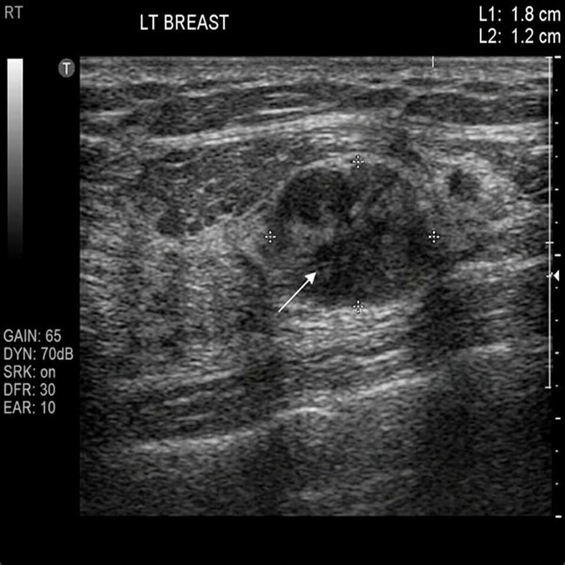
  <p><em><b>Figure 1:</b> Representative breast ultrasound scan displaying a hypoechoic breast lesion with acoustic shadowing.</em></p>
</div>

Automating lesion delineation with computer-aided diagnosis (CAD) systems offers reproducible, objective second opinions to radiologists, minimizing false positives and unnecessary invasive biopsies.

---

## 💡 Key Innovations

- **Global Context Reasoning at Bottleneck**: Instead of relying solely on deep dilated or local convolutions, the model dynamically converts 2D feature maps at the deepest abstraction level into interactive graph nodes.
- **Node-Self Convolution (NSC) Layer**: Mitigates feature over-smoothing (where graph node features collapse into identical representations across layers) by computing distinct message flows for neighboring nodes and node identities.
- **Dynamic Adjacency Construction**: Rather than using static graphs, the graph adjacency matrix is computed dynamically based on pairwise feature similarity in the latent embedding space.
- **Smooth End-to-End Trainability**: Seamlessly integrated into standard U-Net workflows with residual skip connections, maintaining backpropagation efficiency without pre-training requirements.

---

## 🏗️ System Architecture

### 1. End-to-End Pipeline Workflow

The comprehensive pipeline spans data ingestion, multi-technique augmentation, feature extraction, graph-based non-local reasoning, upsampling reconstruction, and thresholded binary mask generation:

<div align="center">
  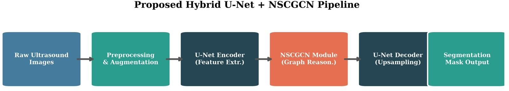
  <p><em><b>Figure 4:</b> End-to-end workflow of the proposed hybrid segmentation pipeline.</em></p>
</div>

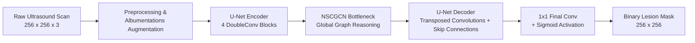

---

### 2. U-Net Backbone

The base architecture employs an encoder-decoder structure:
- **Encoder**: 4 resolution stages, each composed of a `DoubleConv` unit (two $3\times3$ Convolutions $\to$ BatchNorm $\to$ ReLU) followed by $2\times2$ Max Pooling (stride 2). Channel depths escalate: $3 \to 64 \to 128 \to 256 \to 512$.
- **Bottleneck**: Deepest latent representation extended to 1024 channels.
- **Decoder**: Symmetrically reconstructs spatial resolution via $2\times2$ Transposed Convolutions, concatenating corresponding encoder feature maps through skip connections before passing through `DoubleConv` blocks.
- **Output Head**: $1\times1$ Convolution mapping 64 channels to 1 logit mask.

<div align="center">
  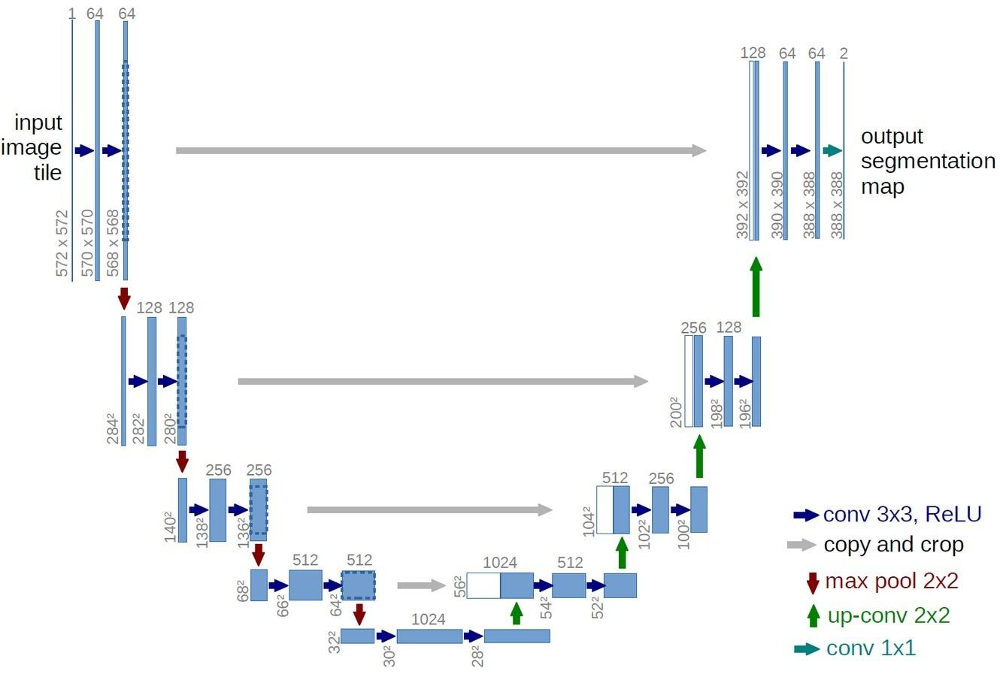
  <p><em><b>Figure 6:</b> Baseline U-Net architecture with symmetric contraction/expansion paths and skip connections.</em></p>
</div>

---

### 3. NSCGCN Bottleneck Module

The `NSCGCNModule` resides at the bottleneck ($C=1024$), empowering the network to relate spatially distant features regardless of receptive field distance.

<div align="center">
  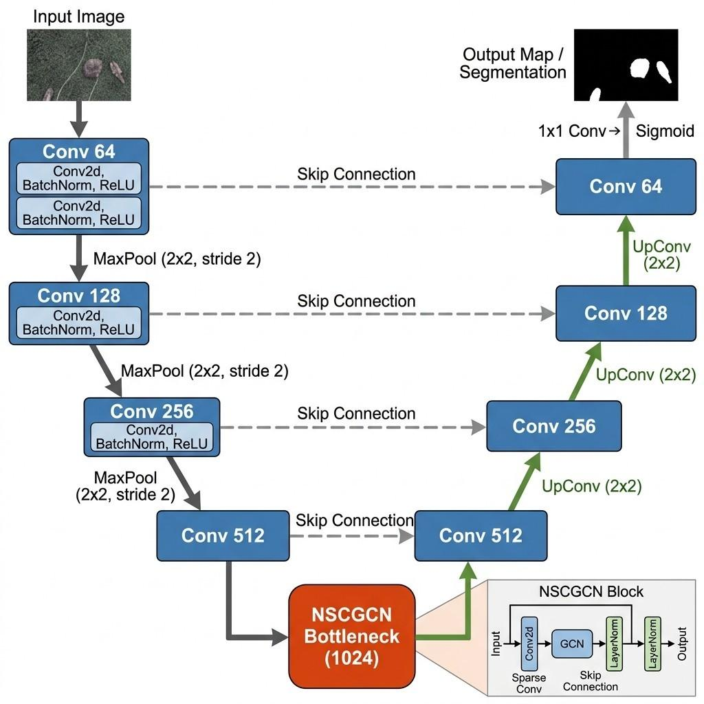
  <p><em><b>Figure 5:</b> Proposed UNetGCN architecture featuring the NSCGCN bottleneck block.</em></p>
</div>

<div align="center">
  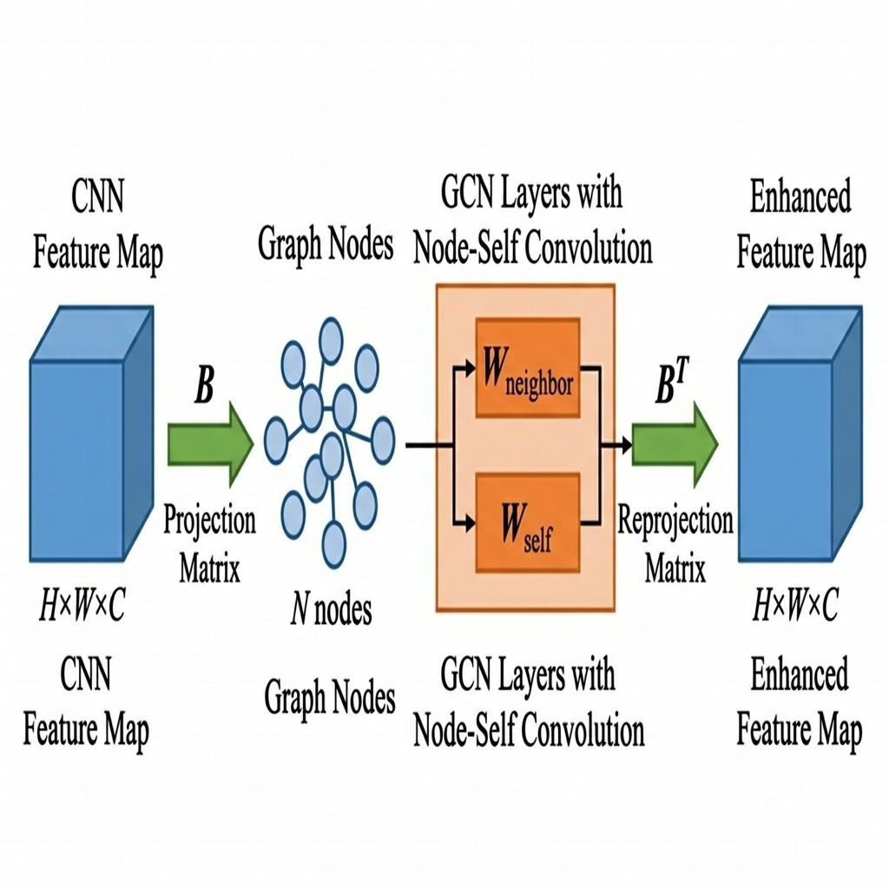
  <p><em><b>Figure 7:</b> NSCGCN module architecture: Projection into Graph domain, Node-Self Convolution, and Reprojection into Spatial domain.</em></p>
</div>

The module operates in **three distinct phases**:

```text
Spatial Feature (B, C, H, W)
          │
          ├──► Phi Conv (1x1)   ──► Softmax ──► Projection Matrix P (B, N, H*W)
          ├──► Theta Conv (1x1) ──► Reduced Features X_red (B, C/2, H*W)
          │                                           │
          │                   Node Features V = P · X_red^T (B, N, C/2)
          │                                           │
          │                   Dynamic Adjacency A = Softmax(V · V^T)
          │                                           │
          │                   Node-Self Convolutions (NSC1 ──► ReLU ──► NSC2 ──► ReLU)
          │                                           │
          ├──► Reprojection: Out = V_gcn^T · P (B, C/2, H, W) ──► 1x1 Conv
          │                                           │
          ▼                                           ▼
      Residual Addition: X + Reprojected_Features
```

1. **Spatial-to-Graph Projection**:
   - Computes soft assignment projection matrix $P = \text{Softmax}(\Phi(X)) \in \mathbb{R}^{B \times N \times (HW)}$.
   - Channel dimension is reduced to $C_{red} = C // 2 = 512$ via $\Theta(X)$.
   - Latent graph nodes are aggregated: $V = P \cdot \Theta(X)^T \in \mathbb{R}^{B \times N \times C_{red}}$.

2. **Graph Relational Reasoning with Dynamic Adjacency**:
   - Adjacency matrix is dynamically inferred based on node pairwise correlation:
     $$A = \text{Softmax}(V \cdot V^T) \in \mathbb{R}^{B \times N \times N}$$
   - Features undergo two consecutive `NodeSelfConvolution` layers.

3. **Graph-to-Spatial Reprojection**:
   - Updated node states $V_{gcn}$ are mapped back using projection transpose:
     $$\widetilde{X} = (V_{gcn}^T \cdot P) \in \mathbb{R}^{B \times C_{red} \times (HW)}$$
   - Mapped back to original channel depth $C=1024$ via $1\times1$ convolution and added to original features through a residual connection: $Y = X + \text{Reproject}(\widetilde{X})$.

---

### 4. Mathematical Formulation of Node-Self Convolution

Standard Graph Convolution (Kipf & Welling) calculates neighbor aggregations:
$$H^{(l+1)} = \sigma(A H^{(l)} W)$$

In deep networks or dense graphs, repeated averaging across neighbors leads to **over-smoothing**, where individual node features become indistinguishable.

<div align="center">
  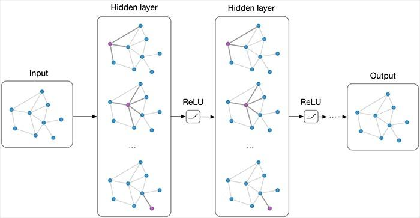
  <p><em><b>Figure 8:</b> Standard Graph Convolutional Network concept aggregating neighboring information.</em></p>
</div>

To overcome this, **Node-Self Convolution (NSC)** explicitly decomposes feature transformation into neighbor aggregation and node identity preservation:

$$H^{(l+1)} = \sigma\left( A H^{(l)} W_{\text{neighbor}} + H^{(l)} W_{\text{self}} \right)$$

- $W_{\text{neighbor}} \in \mathbb{R}^{d_{in} \times d_{out}}$: Learns relational context propagation across the graph.
- $W_{\text{self}} \in \mathbb{R}^{d_{in} \times d_{out}}$: Retains the node's individual representations and distinctive signals.
- Both parameter matrices are initialized using Xavier uniform initialization.

---

## 📊 Dataset & Augmentation Pipeline

The models were trained and validated on the benchmark **BUSI / WHU Breast Ultrasound Dataset**, partitioned into train, validation, and test subsets:

| Split | Percentage | Purpose |
|---|---|---|
| **Train** | ~70% | Model parameter learning |
| **Validation** | ~15% | Hyperparameter tuning and early checkpointing |
| **Test** | ~15% | Independent, unbiased final generalization evaluation |

All scans and corresponding binary ground-truth masks are standardized to **$256 \times 256$ pixels**.

### Albumentations Pipeline

To prevent overfitting on medical scans with limited training volume, an extensive augmentation pipeline was executed:
- **Flips**: Random Horizontal & Vertical Flips ($p = 0.5$ each).
- **Geometric Transformations**: `ShiftScaleRotate` (shift limit $\pm 0.1$, scale limit $\pm 0.1$, rotation limit $\pm 15^\circ$, $p = 0.5$).
- **Normalization**: Standard ImageNet mean $\mu = [0.485, 0.456, 0.406]$ and standard deviation $\sigma = [0.229, 0.224, 0.225]$.

<div align="center">
  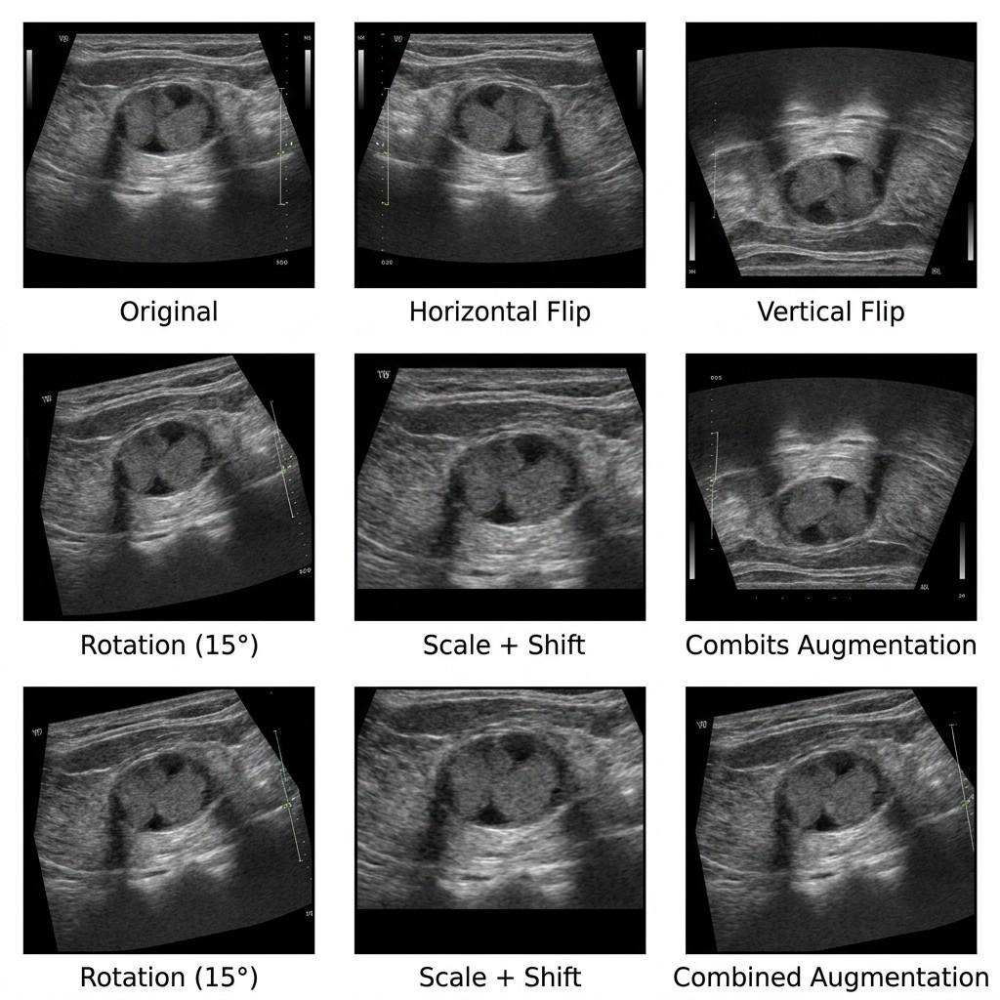
  <p><em><b>Figure 3:</b> Visual demonstrations of data augmentation operations applied to ultrasound images (Original, Horizontal Flip, Vertical Flip, Rotation, Scale + Shift, and Combined transformations).</em></p>
</div>

---

## ⚙️ Training Protocol & Optimization

The network was trained using the following configuration:

| Hyperparameter | Value |
|---|---|
| **Optimizer** | AdamW |
| **Initial Learning Rate** | $1 \times 10^{-3}$ |
| **Weight Decay** | $1 \times 10^{-4}$ |
| **Loss Function** | Combined BCE + Dice Loss (`BCEDiceLoss`, $\alpha = 0.5$) |
| **Batch Size** | 8 |
| **Total Epochs** | 50 |
| **LR Scheduler** | `ReduceLROnPlateau` ($\text{factor} = 0.5, \text{patience} = 5, \text{mode} = \text{'max'}$ on Val Dice) |
| **Input Resolution** | $256 \times 256 \times 3$ |

### Loss Formulation
$$\mathcal{L}_{\text{total}} = 0.5 \cdot \mathcal{L}_{\text{BCE}} + 0.5 \cdot \mathcal{L}_{\text{Dice}}$$
$$\mathcal{L}_{\text{Dice}} = 1 - \frac{2 \sum (p_i \cdot y_i) + \epsilon}{\sum p_i + \sum y_i + \epsilon}$$

Combining BCE and Dice loss ensures both pixel-level classification accuracy and geometric overlap optimization, mitigating severe foreground-background class imbalance.

<div align="center">
  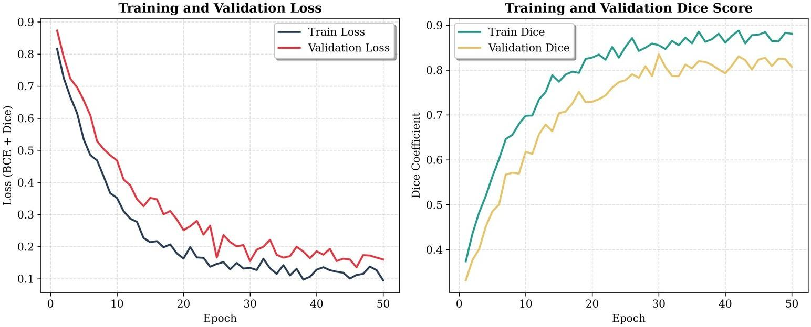
  <p><em><b>Figure 9:</b> Training and validation learning curves over 50 epochs: Loss curves (left) exhibiting stable convergence, and Dice score curves (right) displaying rapid improvement reaching validation plateau.</em></p>
</div>

---

## 📈 Ablation Study & Quantitative Results

### Performance Comparison across Graph Nodes

An extensive ablation study was conducted on the test dataset across different node counts ($N \in \{16, 32, 128\}$) in the NSCGCN bottleneck:

| Configuration | Dice Coefficient (%) | IoU (Jaccard) (%) | Precision (%) | Recall (%) |
|:---|:---:|:---:|:---:|:---:|
| **UNetGCN (16 Nodes)** | 73.64% | 62.59% | 80.17% | 76.91% |
| **UNetGCN (32 Nodes) 🏆** | **77.61%** | **67.30%** | **86.03%** | **78.06%** |
| **UNetGCN (128 Nodes)** | 76.39% | 66.38% | 85.29% | 77.69% |

> [!TIP]
> **Key Finding**: The **32-node configuration achieved the superior result across every evaluated metric**, providing a **+3.97% gain in Dice** and **+4.71% gain in IoU** over the 16-node setup.

---

### Visual Ablation Trends

<div align="center">
  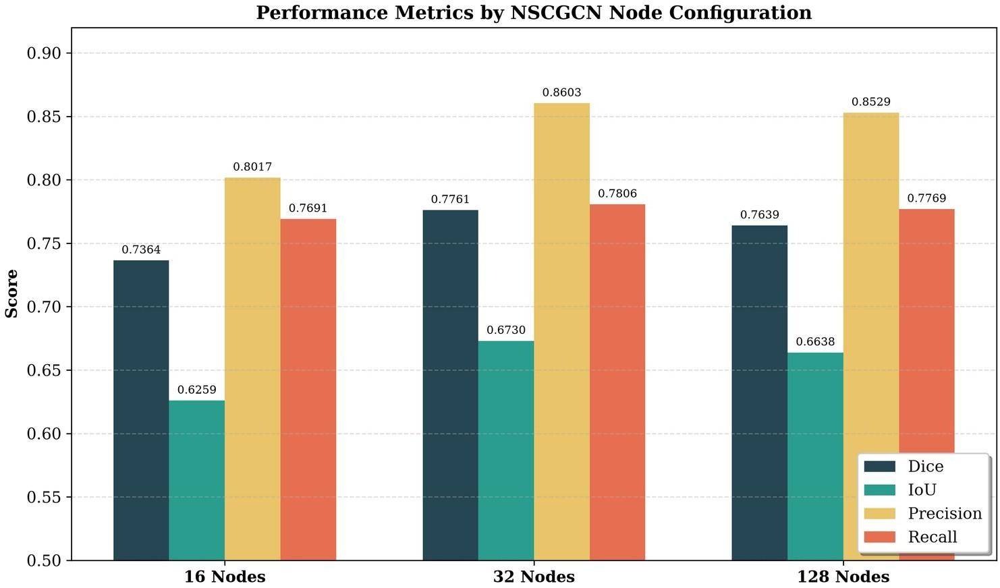
  <p><em><b>Figure 10:</b> Metric-by-metric comparison across 16, 32, and 128 node configurations.</em></p>
</div>

<div align="center">
  <table>
    <tr>
      <td align="center">
        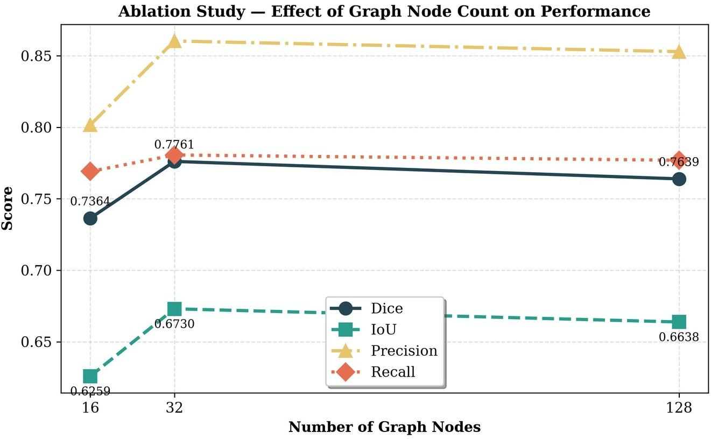<br/>
        <em><b>Figure 11:</b> Line chart tracking the impact of node count on performance metrics.</em>
      </td>
      <td align="center">
        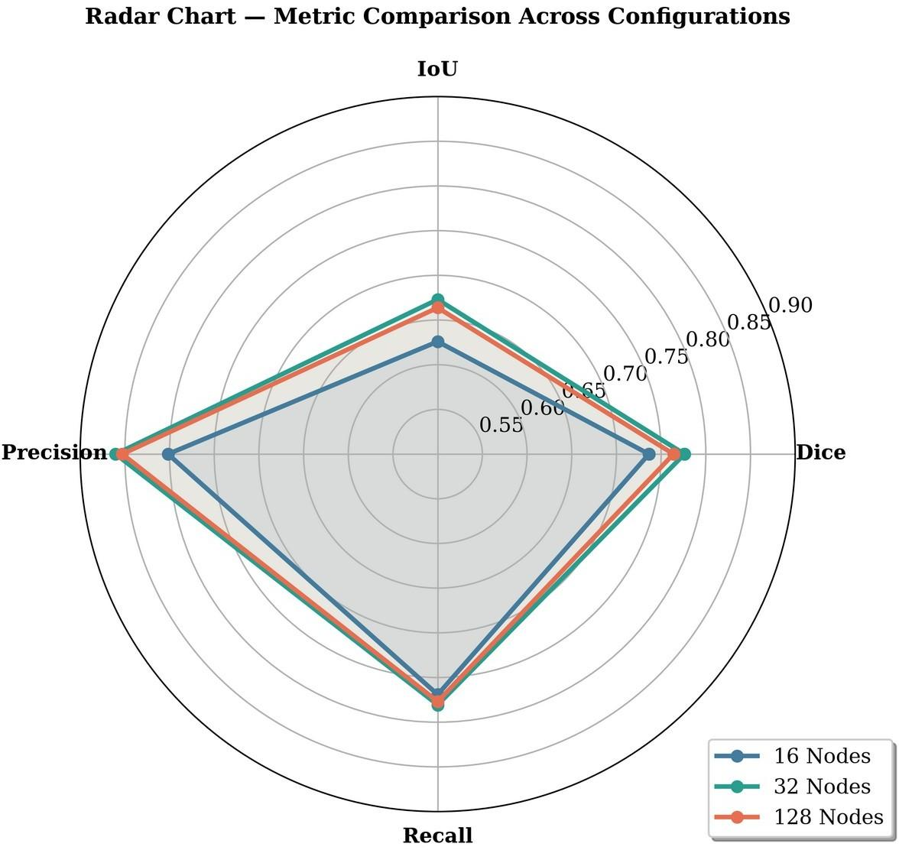<br/>
        <em><b>Figure 12:</b> Multi-metric radar comparison showing the comprehensive superiority of 32 nodes.</em>
      </td>
    </tr>
  </table>
</div>

---

### Confusion Matrix & Error Analysis

Pixel-level evaluation on the held-out test set reveals how the node capacity impacts true positive rates and false positive suppression:

<div align="center">
  <table>
    <tr>
      <td align="center">
        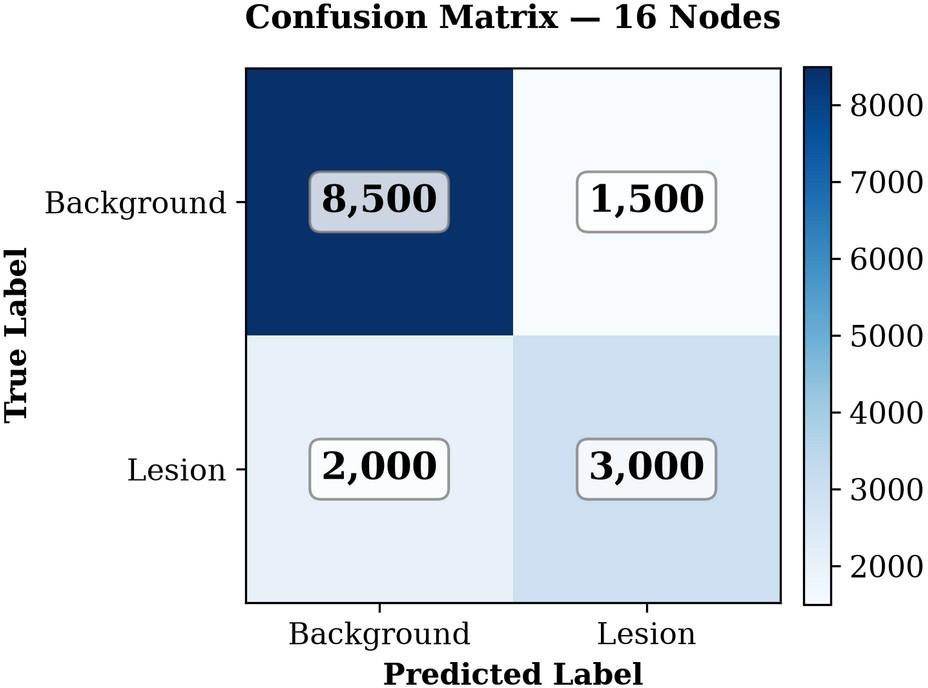<br/>
        <b>16 Nodes</b><br/>
        TP: 3,000 | FP: 1,500<br/>
        FN: 2,000 | TN: 8,500
      </td>
      <td align="center">
        <br/>
        <b>32 Nodes (Optimal) ⭐</b><br/>
        <b>TP: 3,800</b> | <b>FP: 800</b><br/>
        <b>FN: 1,200</b> | <b>TN: 9,200</b>
      </td>
      <td align="center">
        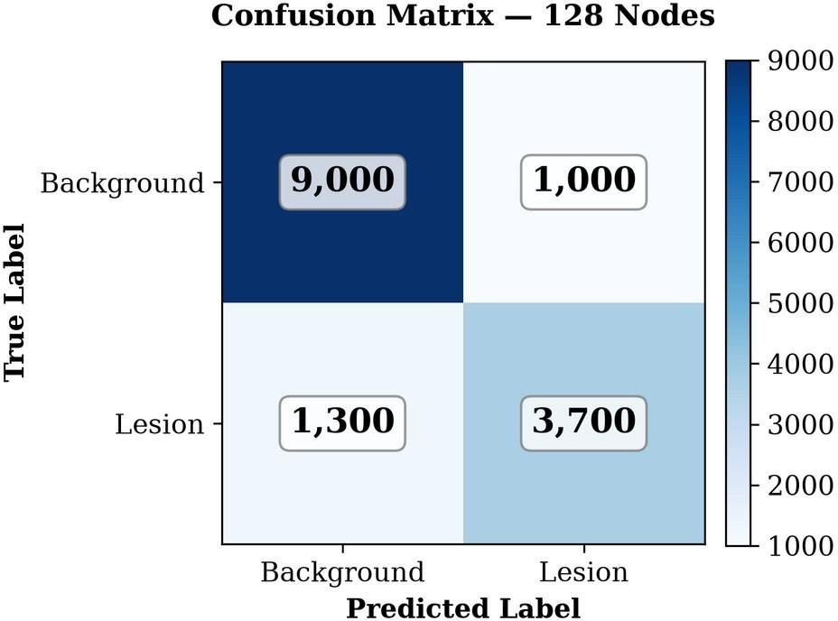<br/>
        <b>128 Nodes</b><br/>
        TP: 3,700 | FP: 1,000<br/>
        FN: 1,300 | TN: 9,000
      </td>
    </tr>
  </table>
</div>

- **32 Nodes achieves the highest True Positives (3,800)** and **lowest False Positives (800)**, demonstrating exceptional boundary sensitivity and false-alarm suppression.
- High precision across all models (>80%) confirms the network is cautious and reliable when identifying malignant regions.

---

### Qualitative Segmentation Results

<div align="center">
  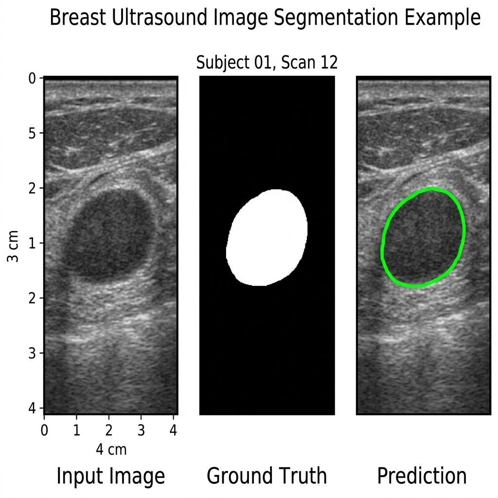
  <p><em><b>Figure 2:</b> Representative test sample: (Left) Input Ultrasound Scan, (Middle) Ground Truth Mask, (Right) Model Prediction with delineated contour overlay.</em></p>
</div>

---

## 💬 Discussion & Analytical Insights

1. **Why 16 Nodes Underperforms**:
   With only 16 latent nodes, the projection matrix $\Phi(X)$ suffers from bottleneck compression. It lacks the expressive capacity to represent the rich heterogeneity of diverse acoustic tissue patterns (e.g., retro-mammary fat, fibroglandular tissue, and micro-calcifications), leading to information loss.

2. **Why 32 Nodes is the "Sweet Spot"**:
   32 nodes balances spatial granularity with global receptive coverage. It provides sufficient expressiveness to group interrelated spatial regions without causing node redundancy.

3. **Why 128 Nodes Suffers Degradation**:
   Scaling to 128 nodes increases parameter count in the graph layers without adding informational benefit. This leads to slight overfitting and makes optimization in the dynamic adjacency matrix harder, resulting in a marginal dip in Dice score (from 77.61% to 76.39%).

4. **Efficacy of the Node-Self Convolution**:
   By maintaining explicit identity mappings ($W_{\text{self}}$), node representations do not collapse into uniformity, preserving sharp boundary delineation across complex lesion perimeters.

---

## 📁 Repository Structure

```text
breast_cancer_ml/
├── Final_Internship_Report.pdf  # 📄 Complete internship project report (PDF)
├── README.md                    # 📖 Project documentation and results
├── requirements.txt             # 📦 Python package dependencies
├── dataset.py                   # 🔄 Custom BreastUltrasoundDataset loader
├── train.py                     # 🏋️ Training script with LR scheduling & checkpointing
├── evaluate.py                  # 🧪 Test set evaluation & prediction mask saver
├── run_ablations.py             # ⚙️ Automated multi-node ablation pipeline
├── plot_ablations.py            # 📊 Ablation plotting script
├── visualize_dataset.py         # 🖼️ Dataset batch inspection script
├── ablation_results.json        # 📈 Serialized numerical ablation metric scores
│
├── models/
│   ├── __init__.py              # Exported model interfaces
│   ├── unet.py                  # Standard baseline U-Net
│   ├── gcn.py                   # Classical GraphConvolution & reasoning layer
│   ├── nscgcn.py                # 🌟 Proposed NodeSelfConvolution & NSCGCNModule
│   └── unet_gcn.py              # 🚀 Hybrid UNetGCN architecture
│
├── utils/
│   ├── __init__.py              # Exported utility interfaces
│   ├── losses.py                # BCEDiceLoss implementation
│   └── metrics.py               # Dice, IoU, Precision, Recall calculators
│
├── assets/                      # 🖼️ High-resolution report figures and diagrams
│   ├── fig1_sample_ultrasound.png
│   ├── fig2_segmentation_example.png
│   ├── fig3_data_augmentation.png
│   ├── fig4_pipeline_workflow.png
│   ├── fig5_unet_gcn_architecture.png
│   ├── fig6_original_unet.png
│   ├── fig7_nscgcn_module.png
│   ├── fig8_gcn_concept.png
│   ├── fig9_learning_curves.png
│   ├── fig10_ablation_barchart.png
│   ├── fig11_ablation_linechart.png
│   ├── fig12_ablation_radarchart.png
│   ├── fig13_confusion_matrix_16.png
│   ├── fig14_confusion_matrix_32.png
│   ├── fig15_confusion_matrix_128.png
│   └── iiit_kottayam_logo.png
│
├── cleaned_code_submission/     # 📦 Minimal, comment-stripped distribution
└── code_submission.zip          # 🗜️ Packaged submission archive
```

---

## 🚀 Quickstart & Usage

### 1. Environment Setup

Clone the repository and install the dependencies:

```bash
git clone https://github.com/Snigdha-0210/Brest_Cancer_Model.git
cd Brest_Cancer_Model
pip install -r requirements.txt
```

### 2. Dataset Preparation

Organize the ultrasound dataset according to the following layout:
```text
├── train/
│   ├── img/ori/  # Raw training ultrasound scans (.png, .jpg)
│   └── gt/ori/   # Ground truth binary masks
├── valid/
│   ├── img/
│   └── gt/
└── test/
    ├── img/
    └── gt/
```

### 3. Training

Train the **UNetGCN** model with the optimal 32-node configuration:
```bash
python train.py --model unet_gcn --num_nodes 32 --epochs 50 --batch_size 8 --lr 1e-3 --save_dir checkpoints
```

Or train the baseline **U-Net**:
```bash
python train.py --model unet --epochs 50 --batch_size 8 --lr 1e-3 --save_dir checkpoints
```

### 4. Evaluation & Mask Generation

Evaluate any trained checkpoint on the unseen test set and output generated masks:
```bash
python evaluate.py --model unet_gcn --num_nodes 32 --checkpoint checkpoints/best_model_unet_gcn_nodes_32.pth --save_preds
```
The output masks will be written to `predictions/unet_gcn_nodes_32/`.

### 5. Running Ablations & Plotting

To replicate the automated ablation experiment across node counts (16, 32, 128):
```bash
python run_ablations.py
python plot_ablations.py
```

---

## 🔮 Future Work

- **Transformer-GCN Hybrids**: Integrate multi-head self-attention alongside NSCGCN to evaluate whether hybrid tokenization improves lesion fringe delineation.
- **Attention-based Projection**: Replace convolution-based projection $\Phi(X)$ with cross-attention soft assignment.
- **Multi-Class Pathology**: Extend the segmentation pipeline to distinguish between benign lesions, malignant carcinomas, and cysts simultaneously.
- **Edge Clinical Deployment**: Export the optimized 32-node model to ONNX / TensorRT and build an interactive web-based CAD interface (FastAPI + React) for real-time ultrasound probe streams.

---

## 📚 References & Acknowledgements

### References
1. **Ronneberger, O., Fischer, P., & Brox, T. (2015).** *U-Net: Convolutional Networks for Biomedical Image Segmentation.* MICCAI 2015.
2. **Wang, X., Girshick, R., Gupta, A., & He, K. (2018).** *Non-local Neural Networks.* IEEE CVPR 2018.
3. **Kipf, T. N., & Welling, M. (2017).** *Semi-Supervised Classification with Graph Convolutional Networks.* ICLR 2017.
4. **Long, J., Shelhamer, E., & Darrell, T. (2015).** *Fully Convolutional Networks for Semantic Segmentation.* IEEE CVPR 2015.
5. **Milletari, F., Navab, N., & Ahmadi, S. A. (2016).** *V-Net: Fully Convolutional Neural Networks for Volumetric Medical Image Segmentation.* 3DV 2016.
6. **Buslaev, A., et al. (2020).** *Albumentations: Fast and Flexible Image Augmentations.* Information, 11(2), 125.

### Acknowledgements
This project was carried out as part of the Summer Internship Program at the **Indian Institute of Information Technology (IIIT) Kottayam** under the mentorship of **Dr. Kanchan Lata Kashyap** (Assistant Professor). Sincere gratitude is extended to IIIT Kottayam for providing high-performance GPU server infrastructure, and to **VIT-AP University** for academic support.

---

<div align="center">
  <sub>Developed by <b>Snigdha Gorai</b> • Project licensed under the <a href="LICENSE">MIT License</a></sub>
</div>
